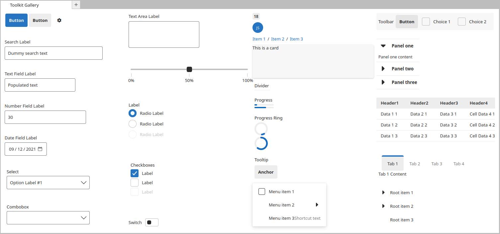

# UI Toolkit for Jupyter

**WIP this is very early work in progress and nothing is yet working.** But don't hesitate to open issues and PRs if you want to help.


[](https://www.npmjs.com/package/@jupyter-notebook/ui-components)


[](https://mybinder.org/v2/gh/jupyterlab-contrib/jupyter-ui-toolkit/main)



## Introduction

The UI Toolkit is a component library for building web interfaces in Jupyter ecosystem (JupyterHub, Jupyter Widgets, JupyterLab,...).

Features of the library include:

- **Implements the Jupyter design language:** All components follow the design language of Jupyter – enabling developers to create extensions that have a consistent look and feel with the rest of the ecosystem.
- **Automatic support for color themes:** All components are designed with theming in mind and will automatically display the current application theme.
- **Use any tech stack:** The library ships as a set of web components, meaning developers can use the toolkit no matter what tech stack (React, Vue, Svelte, etc.) their extension is built with.
- **Accessible out of the box:** All components ship with web standard compliant ARIA labels and keyboard navigation.

Note this project started as a fork of the [WebView toolkit for Visual Studio Code](https://github.com/microsoft/vscode-webview-ui-toolkit) (licensed under MIT) on which Jupyter design specification. The fundamental technology used is [Fast Design](https://www.fast.design/).

## Release

The UI Toolkit is currently in a proof of concept. Track progress towards 1.0 [here](https://github.com/jupyterlab-contrib/jupyter-ui-toolkit/issues?q=is%3Aopen+is%3Aissue+milestone%3Av1.0). Styles and API
are not guarantee between minor versions prior to v1.0.0.

## Getting started

<!--
Follow the [Getting Started Guide](./docs/getting-started.md).

If you already have a webview-based extension, you can install the toolkit with the following command:

```
npm install --save @vscode/webview-ui-toolkit
```
-->

## Documentation

Further documentation can be found in the following places:

- [Component Docs](./packages/components/docs/components.md)
- [Storybook (Interactive Component Sandbox)](https://jupyterlab-contrib.github.io/jupyter-ui-toolkit/)
- [Toolkit Extension Samples](./packages/lab-example)

## Contributing

See the [contributing](./CONTRIBUTING.md) documentation.
